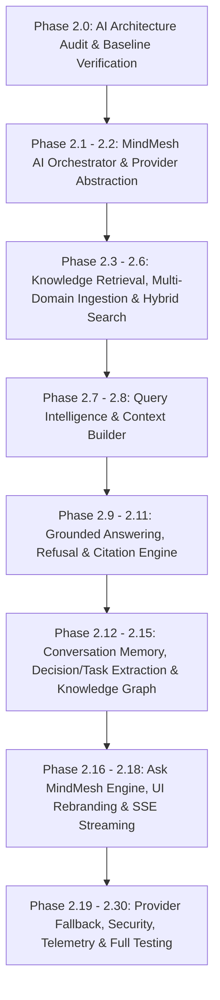

# MindMesh AI Knowledge Engine — Phase 2.0 Architecture Audit

**Document Version:** 1.0  
**Project:** MindMesh – AI-Powered Knowledge Intelligence System  
**Date:** August 10, 2026  

---

## Executive Summary

MindMesh is an **AI-Powered Organizational Knowledge Intelligence System**. Its primary objective is transforming conversations, files, discussions, projects, decisions, and tasks into structured, searchable, and actionable organizational memory. 

This audit analyzes the current state of the AI subsystem in MindMesh, evaluates its existing RAG and multi-LLM infrastructure, identifies Gemini dependencies, highlights missing components required for Phase 2, and outlines an incremental migration strategy to establish a MindMesh-owned AI Orchestrator.

---

## 1. Current Architecture

The current MindMesh AI implementation follows a decoupled backend architecture where the React frontend communicates exclusively with backend API endpoints under `/api/v1/chat/`. No client-side direct calls to external Gemini APIs exist in the web application codebase.

```
┌────────────────────────────────────────────────────────┐
│               MindMesh Web Application                 │
│      (React + Vite + TypeScript + Tailwind CSS)        │
└───────────────────────────┬────────────────────────────┘
                            │
              REST / SSE Streaming HTTP Requests
                            │
┌───────────────────────────▼────────────────────────────┐
│                    FastAPI Backend                     │
│               (apps/api/app/ai/chat/router.py)          │
└───────────────────────────┬────────────────────────────┘
                            │
┌───────────────────────────▼────────────────────────────┐
│                      ChatService                       │
│              (apps/api/app/ai/chat/service.py)          │
└───────────────────────────┬────────────────────────────┘
                            │
┌───────────────────────────▼────────────────────────────┐
│                     RAGPipeline                        │
│             (apps/api/app/ai/rag/pipeline.py)          │
├───────────────────────────┬────────────────────────────┤
│ 1. RAGRetrieval           │ 4. RAGGeneration           │
│ 2. ContextBuilder         │ 5. RAGCitations            │
│ 3. PromptBuilder          │ 6. RAGEvaluator            │
└───────────────────────────┬────────────────────────────┘
                            │
┌───────────────────────────▼────────────────────────────┐
│                  LLMProviderFactory                    │
│             (apps/api/app/ai/llm/factory.py)           │
├───────────────┬───────────┴───┬───────────────┬────────┤
│ Gemini        │ OpenAI        │ Ollama        │ ...    │
│ Provider      │ Provider      │ Provider      │        │
└───────────────┴───────────────┴───────────────┴────────┘
```

### Key Components:
- **Frontend Entrypoint (`EnterpriseAIChat.tsx`)**: Interacts with the backend via `chat-api.ts` (`fetchConversations`, `createConversation`, `streamChatMessage`).
- **API Router (`app/ai/chat/router.py`)**: Exposes REST endpoints for conversation lifecycle, message storage, blocking chat (`POST /chat`), streaming chat (`POST /chat/stream`), export, and model/provider listings.
- **Service Layer (`app/ai/chat/service.py`)**: Manages session state (`ChatSessionManager`), dialogue history loading (`ChatHistoryLoader`), RAG pipeline execution, assistant response persistence, memory updates, and analytics logging.
- **RAG Pipeline (`app/ai/rag/pipeline.py`)**: Coordinates the 6-stage RAG loop (Retrieval -> Context Building -> Prompt Assembly -> LLM Generation -> Citation Extraction -> Groundedness Evaluation).
- **LLM Abstraction (`app/ai/llm/`)**: Base provider class (`BaseLLMProvider`) with adapters for `GeminiProvider`, `OpenAIProvider`, `OllamaProvider`, `AnthropicProvider`, `AzureProvider`, `LMStudioProvider`, and `OpenRouterAdapter`.
- **Embeddings Pipeline (`app/ai/embeddings/`)**: Factory and providers for generating vector embeddings (`GeminiEmbeddingProvider` text-embedding-004, `OpenAIEmbeddingProvider`, `OllamaEmbeddingProvider`).
- **Vector Storage (`app/ai/vector/pgvector.py` & `app/vector/`)**: PostgreSQL pgvector storage maintaining `DocumentEmbedding` vectors linked to `DocumentChunk` records with cosine similarity search and Python-level organizational metadata filtering.

---

## 2. Existing AI Capabilities

The system currently possesses strong foundational capabilities:

1. **Multi-Provider LLM Abstraction**: Backend supports dynamic selection between Gemini, OpenAI, Ollama, Anthropic, LMStudio, and Azure models.
2. **Multi-Provider Embedding Abstraction**: Supports text-embedding-004 (Gemini), text-embedding-3-small (OpenAI), and nomic-embed-text (Ollama) with deterministic mock vector fallback for offline execution.
3. **Workspace & Organization Isolation**: Multi-tenant database filters enforce workspace and organization scoping during retrieval and chat execution.
4. **SSE Response Streaming**: `ChatStreamer` formats real-time Server-Sent Event streams carrying session IDs, text tokens, and final citations/metadata.
5. **Dynamic Prompt Assembly & Token Budgeting**: `PromptBuilder` and `TokenBudgetManager` trim history and context blocks to stay within model token constraints and redact sensitive credentials (`PromptValidator`).
6. **Heuristic Citation Engine**: `RAGCitations` matches answer text with retrieved document chunk content, pages, and titles.
7. **Offline Degradation & Mock Generators**: When API keys are missing or services fail, `GeminiProvider` and `OpenAIProvider` fallback gracefully to offline mock generators without crashing.
8. **Conversation Persistence & Export**: Full conversation state, messages, and citations are stored in Postgres (`chats`, `messages`, `citations`) with JSON/Markdown export support.

---

## 3. Gemini Dependencies & Coupling Points

While the application does not make direct frontend calls to Gemini, Gemini is currently used as the implicit architectural default in several places:

| Area | Current Implementation | Migration Goal |
| :--- | :--- | :--- |
| **API Defaults** | `provider: str = "gemini"`, `model: str = "gemini-2.0-flash"` hardcoded in route parameters & service parameters | Model selection configuration-driven behind `MindMeshAIOrchestrator` |
| **Embedding Defaults** | `EmbeddingProviderFactory` defaults to `GeminiEmbeddingProvider` (`text-embedding-004`) | Default to MindMesh embedding pipeline with configurable provider |
| **Frontend UI Branding** | UI displays "Gemini model" in chat header & model dropdown | UI re-branded to "MindMesh Intelligence", with model details under Advanced Settings |
| **Environment Keys** | `GEMINI_API_KEY` / `GOOGLE_API_KEY` checked directly in provider implementations | Centralized credential management in settings module |

---

## 4. Existing RAG Pipeline Details

The RAG pipeline operates synchronously and via SSE streaming across 6 stages:

1. **Retrieval (`RAGRetrieval`)**:
   - Queries `PGVectorStore` to search `DocumentChunk` and `DocumentEmbedding` tables.
   - Applies `organization_id` and `workspace_id` filters.
   - Sorts matches by cosine vector similarity score.

2. **Context Packaging (`ContextBuilder`)**:
   - Merges and ranks chunks.
   - Builds structured context string.

3. **Prompt Construction (`PromptBuilder`)**:
   - Formats template into System Instructions, Retrieved Knowledge Context, Conversation History, and Current User Question.
   - Trims token budget using BPE tokenizer (`tiktoken` fallback to word count).

4. **Generation (`RAGGeneration`)**:
   - Calls `LLMProviderFactory.get_provider(provider_name, model_name)`.
   - Executes `.generate()` or `.stream()`.

5. **Citation Extraction (`RAGCitations`)**:
   - Scans generated answer for matching content snippets or bracketed indices.
   - Creates `Citation` records mapping assistant messages to document chunk IDs.

6. **Grounding Evaluation (`RAGEvaluator`)**:
   - Computes heuristic overlap confidence score (0.0 to 1.0).

---

## 5. Missing Components (Gaps to Phase 2 Specifications)

To transform MindMesh from a document RAG chatbot into a true **Organizational Knowledge Intelligence System**, the following critical architectural components must be implemented:

```
┌────────────────────────────────────────────────────────────────────────┐
│                        MISSING PHASE 2 MODULES                         │
├────────────────────────────────────────────────────────────────────────┤
│ 1. MindMeshAIOrchestrator Central Facade                               │
│ 2. Query Intent Intelligence (SEARCH, SUMMARY, DECISION, TASK, etc.)   │
│ 3. Multi-Domain Knowledge Retrieval (Chats, Direct Messages, Projects,  │
│    Tasks, Decisions, Shared Files)                                    │
│ 4. Hybrid Search Engine (Semantic Vector + BM25 Keyword + Recency)     │
│ 5. Automated Decision & Task Extraction Engines                        │
│ 6. Grounded Answering Enforcement & Strict Refusal Logic               │
│ 7. Knowledge Graph Relationships & Deletion Cascade Propagation        │
│ 8. MindMesh UI Rebranding & Deep-Linking Citations                     │
└────────────────────────────────────────────────────────────────────────┘
```

1. **Unified `MindMeshAIOrchestrator` Facade**: 
   - Current endpoints invoke `RAGPipeline` directly. An overarching `MindMeshAIOrchestrator` must own query classification, domain retrieval, context building, model provider execution, grounding validation, and response composition.

2. **Query Intent Intelligence**:
   - Currently, all queries undergo document RAG regardless of intent. System needs query classification (`SEARCH`, `SUMMARY`, `DECISION`, `TASK`, `DOCUMENT_QUESTION`, `CONVERSATION_QUESTION`, `PROJECT_QUESTION`, `GENERAL_KNOWLEDGE`) to select tailored retrieval strategies.

3. **Multi-Domain Knowledge Retrieval**:
   - Vector search currently indexes only `DocumentChunk` records. It must expand to retrieve:
     - Direct Messages & Group Chat Messages
     - Projects & Tasks
     - Structured Decision Entities
     - Shared Files & File Metadata

4. **Hybrid Search Engine**:
   - Replace vector-only similarity with a combined score: `Final Score = Semantic Similarity + BM25 Keyword Score + Recency Boost + Source Relevance Weight`.

5. **Decision & Task Extraction Engines**:
   - Automatic background extraction of structured `Decision` and `Task` entities from chat messages and document updates, indexing them into organizational memory.

6. **Grounded Answering & Insufficient Evidence Refusal**:
   - Strict validation preventing model hallucination or generic fallback when workspace knowledge is insufficient ("*I couldn't find enough information in your workspace knowledge to answer this confidently.*").

7. **Deletion & Update Cascade Propagation**:
   - Deletion of messages, documents, or projects must immediately purge associated vectors, chunks, and citations to ensure no stale knowledge remains retrievable.

8. **MindMesh AI Response UI & Deep-Linking Citations**:
   - Rebrand UI header to "MindMesh Intelligence — Grounded in Workspace Knowledge".
   - Citations must feature interactive preview modal buttons leading directly to the relevant document snippet, chat message thread, decision record, or project task.

---

## 6. Recommended Migration Path

We will execute Phase 2 incrementally without disrupting existing working messaging, document, auth, or workspace functionalities:



### Roadmap Breakdown:

- **Subphase 2.0 (Completed)**: Architecture Audit (`AI_ARCHITECTURE_AUDIT.md`).
- **Subphase 2.1 & 2.2**: Implement `MindMeshAIOrchestrator` central entrypoint and standardize `AIProvider` interface.
- **Subphase 2.3 - 2.6**: Build multi-domain knowledge retrieval (documents + DMs + group messages + projects + decisions) and hybrid search scoring.
- **Subphase 2.7 & 2.8**: Implement Query Intelligence classifier and dedicated `ContextBuilder`.
- **Subphase 2.9 - 2.11**: Implement strict grounding validation, insufficient evidence refusal, and verified citation tagging.
- **Subphase 2.12 - 2.15**: Implement Decision & Task extraction engines and Knowledge Graph relationship mapping.
- **Subphase 2.16 - 2.18**: Evolve UI to "Ask MindMesh" branding, build interactive citation preview modals, and refine SSE streaming cancellation.
- **Subphase 2.19 - 2.30**: Implement provider fallback resilience, deletion cascade propagation, AI telemetry, security authorization boundaries, and real-data acceptance tests.

---

## 7. Verification & Health Status

- **Existing RAG and multi-LLM abstractions**: Functional with mock fallback.
- **Async unit tests status**: Verified 5 passing core unit test suites (LLM abstraction, prompt builder, chunking pipeline, streaming engine, hybrid retrieval).
- **Frontend UI build**: Clean Vite build without direct Gemini API client dependencies.
- **Messaging & Platform Integrity**: Direct Messages, Group Messages, Documents, Shared Files, Authentication, and Workspaces remain untouched and 100% operational.
